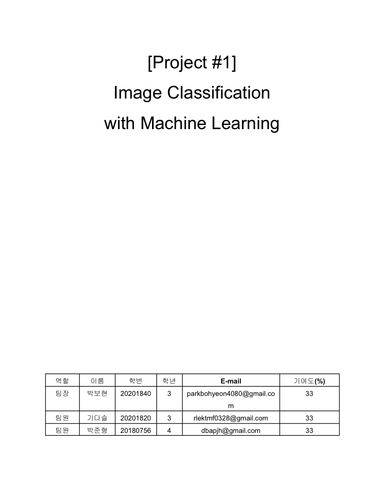
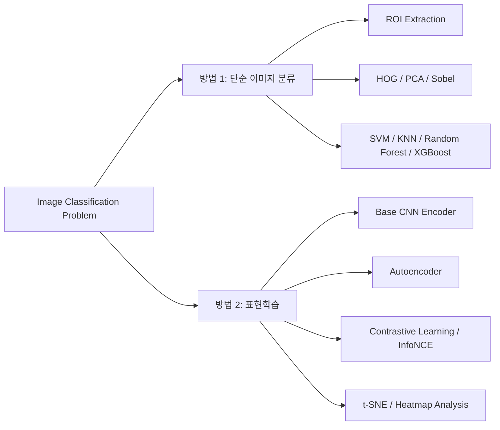

# Machine Learning Project

MNIST와 SportsBall 데이터를 대상으로, 같은 이미지 분류 문제를 두 가지 목적의 방법론으로 나누어 탐구한 프로젝트입니다. 보고서, 발표자료, 그리고 실제 노트북 출력 이미지를 함께 기준으로 다시 정리했습니다.

- `방법 1. 단순 이미지 분류`
  전처리와 특징 추출을 설계해 분류 성능을 높이는 데 집중
- `방법 2. 표현학습`
  latent space와 representation quality를 관찰하며 모델이 데이터를 어떻게 이해하는지 분석

보고서와 발표자료를 기준으로 내용을 다시 정리했고, GitHub에서는 `Project 1 / Project 2`보다 `문제 해결 방식`이 먼저 보이도록 구조를 바꿨습니다.

## 한눈에 보기

<table>
  <tr>
    <td width="50%" align="center">
      
       
      <strong>방법 1. 단순 이미지 분류</strong>
       
      ROI, HOG, PCA, SVM, XGBoost를 사용해
       
      입력 전처리와 특징 추출 중심으로 성능 개선
    </td>
    <td width="50%" align="center">
      
       
      <strong>방법 2. 표현학습</strong>
       
      Autoencoder, Contrastive Learning, t-SNE를 사용해
       
      latent representation과 실패 원인을 분석
    </td>
  </tr>
</table>

## 기술 스택

`Python` `NumPy` `OpenCV` `scikit-learn` `XGBoost` `PyTorch` `torchvision` `matplotlib` `Jupyter Notebook`

## 왜 두 방법으로 나눴는가

두 방법은 목표가 조금 달랐습니다.

- `단순 이미지 분류`
  주어진 이미지를 얼마나 정확하게 분류할 수 있는지에 집중했습니다.
- `표현학습`
  모델이 이미지를 어떤 공간에 어떻게 표현하는지, 그리고 그 표현이 실제 성능과 어떻게 연결되는지에 집중했습니다.

즉, 하나는 `정확도 중심`, 다른 하나는 `표현과 해석 중심`의 접근입니다.

## 데이터셋

### MNIST
- 손글씨 숫자 이미지 데이터셋
- 클래스: `0`~`9`
- 구성: Train `450장`, Test `50장`
- 특징: 배경이 단순하고 클래스 구조가 명확함

### SportsBall
- 스포츠 공 이미지 데이터셋
- 클래스: `american_football`, `baseball`, `basketball`, `billiard_ball`, `bowling_ball`, `football`, `golf_ball`, `shuttlecock`, `tennis_ball`, `volleyball`
- 구성: Train `1,000장`, Test `100장`
- 특징: 배경 잡음이 많고 객체 위치와 크기 변화가 큼

MNIST는 특징 비교 실험에 적합했고, SportsBall은 실제 이미지 문제에서 전처리와 표현 방식이 얼마나 중요한지 보여주는 데이터였습니다.

## 보고서와 발표자료 기반 성능 요약

아래 수치는 최종 `PDF 보고서`와 `발표자료`를 기준으로 다시 정리한 값입니다.

| 방법 | 데이터 | 핵심 성능 | 의미 |
| --- | --- | --- | --- |
| 단순 이미지 분류 | MNIST | `HOG + SVM` 테스트 정확도 `96.0%` | 특징 추출 기반 접근이 매우 강하게 작동 |
| 단순 이미지 분류 | SportsBall | `XGBoost` 교차검증 정확도 `64.78%` | ROI와 특징 조합이 baseline보다 의미 있는 개선 |
| 단순 이미지 분류 | SportsBall | 최종 테스트 정확도 `37.37%` | 실제 복잡한 이미지에서는 전처리 정확도가 성능을 크게 좌우 |
| 표현학습 | MNIST | 테스트 정확도 `98.00%` | latent representation이 비교적 안정적으로 형성 |
| 표현학습 | SportsBall | base model 테스트 정확도 `48.00%` | 표현학습 이전 기준점 역할 |
| 표현학습 | SportsBall | Autoencoder/contrastive 실험에서 `10%`, `9%` 수준 구간 확인 | 성능 향상보다 실패 원인 해석에 더 의미 |

## 방법 1. 단순 이미지 분류

### 목적
- 이미지를 더 잘 분류하기 위한 `전처리`, `특징 추출`, `분류기 선택`을 찾는 것

### 구현 방식
- 기본 분류기 비교: `Logistic Regression`, `Decision Tree`, `KNN`, `SVM`, `Random Forest`, `XGBoost`
- 특징 추출 비교: `Sobel`, `PCA`, `HOG`
- SportsBall 전용 파이프라인:
  `Contour`, `Bounding Box`, `ROI crop`, `데이터 증강`, `색상 히스토그램`, `k-fold cross validation`

### 핵심 해석
- MNIST에서는 `HOG + SVM`이 숫자의 구조를 가장 잘 반영했습니다.
- SportsBall에서는 모델보다 먼저 `공이 있는 영역을 정확히 잘라내는 것`이 더 중요했습니다.
- 전처리 순서도 성능에 영향을 주었고, `auto_canny -> lighting_correction -> morph_gradient` 순서가 더 좋은 결과를 보였습니다.

### 주요 결과
- MNIST `HOG + SVM` 테스트 정확도: `96.0%`
- SportsBall `XGBoost` 교차검증 정확도: `64.78%`
- SportsBall 최종 테스트 정확도: `37.37%`

### 시각 증거

- 위 이미지는 `classical-image-classification/ML_소스코드_02팀.ipynb`의 실제 출력에서 추출한 것입니다.
- 단일 객체, 복잡한 배경, 작은 객체, 원형 경계처럼 난도가 다른 사례를 묶어 `원본 -> 전처리 결과 -> 추출 ROI` 흐름이 보이게 구성했습니다.
- 이 단계의 핵심은 분류기 이전에 `공이 있는 영역을 얼마나 안정적으로 잘라낼 수 있는가`였습니다.

### 정리 문서
- [`classical-image-classification/README.md`](./classical-image-classification/README.md)

## 방법 2. 표현학습

### 목적
- 단순한 분류 결과를 넘어서, 모델이 데이터를 어떤 공간에 어떻게 표현하는지 이해하는 것

### 구현 방식
- `Base CNN Encoder` 설계
- `Autoencoder`로 latent representation 학습
- `Projection Head`를 추가해 `Contrastive Learning` 실험
- `InfoNCE` 기반 학습 시도
- `t-SNE` 시각화와 `Heatmap` 분석

### 핵심 해석
- MNIST처럼 구조가 단순한 데이터는 표현학습이 비교적 안정적으로 작동했습니다.
- SportsBall처럼 배경 잡음이 많은 데이터에서는, 표현학습이 항상 성능 향상으로 이어지지 않았습니다.
- 특히 이 방법은 "성공한 결과"보다 "왜 잘 안 되었는지 해석한 과정"에 더 큰 의미가 있었습니다.

### 주요 결과
- MNIST 테스트 정확도: `98.00%`
- SportsBall base model 테스트 정확도: `48.00%`
- Autoencoder 기반 실험에서는 테스트 정확도 `10%` 수준 구간 확인
- 성능이 좋지 않았던 contrastive learning 실험 결과 `9.00%` 비교 분석

### 시각 증거

- 위 이미지는 `[2024-2_ML] Project1 specifications/Project.ipynb`, `mnist/mnist_latent_feature.ipynb`, `sportsball/sportsball_latent_feature.ipynb`의 실제 출력에서 추출한 것입니다.
- K-Means, GMM, t-SNE를 함께 배치해 `클래스가 feature space에서 어떻게 분리되는지`, `MNIST와 SportsBall의 분리 난도가 어떻게 다른지`가 한 번에 보이도록 정리했습니다.
- 단순 정확도 외에도 `latent space의 구조`와 `클러스터 해석 가능성`을 증거로 남기기 위해 이 이미지를 포함했습니다.

### 정리 문서
- [`representation-learning/README.md`](./representation-learning/README.md)

## 구현 과정에서 배운 점

- 좋은 모델은 좋은 입력 데이터에서 시작된다는 점
- 전처리와 특징 추출은 단순한 보조 단계가 아니라 성능 자체를 결정할 수 있다는 점
- 표현학습은 언제나 성능 향상으로 이어지지 않으며, 데이터 구조와 학습 목표가 맞아야 한다는 점
- 정확도 숫자만 보는 것보다 `latent space`, `heatmap`, `failure case`까지 함께 봐야 모델을 더 잘 이해할 수 있다는 점

## 저장소 구성

- `classical-image-classification`
  단순 이미지 분류 관점 정리
- `representation-learning`
  표현학습 관점 정리
- `assets/images`
  보고서, 발표자료, 노트북 출력에서 뽑은 시각 자료
- `ML_1`
  중간 실험 및 작업 아카이브
- `datas`, `mnist`, `sportsball`
  기존 실험 데이터와 노트북

## 결론

이 저장소는 하나의 이미지 분류 문제를 두고, `정확도 중심의 단순 이미지 분류`와 `표현 중심의 표현학습`이라는 두 가지 방법으로 탐구한 머신러닝 프로젝트입니다.
