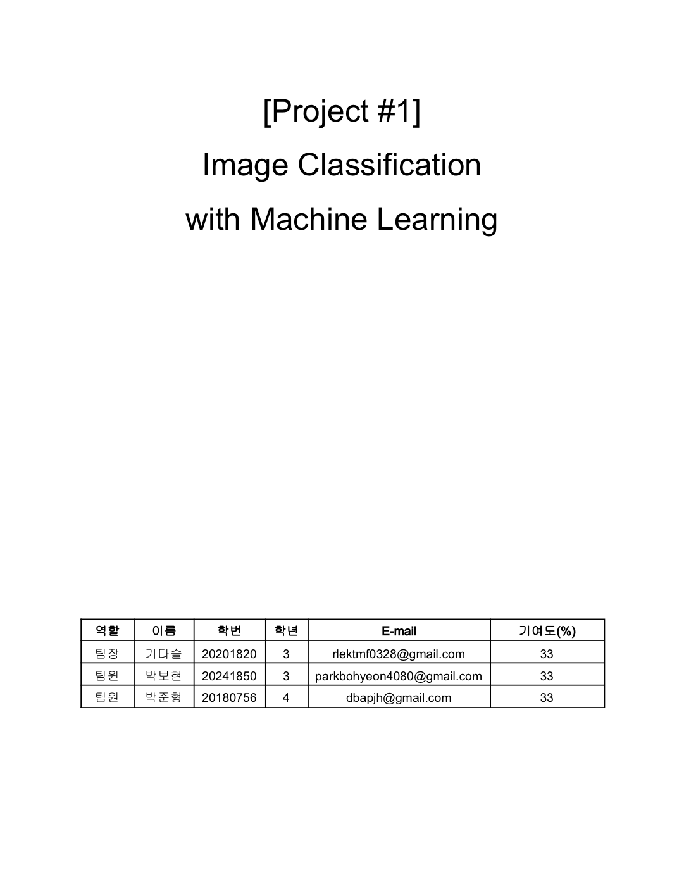
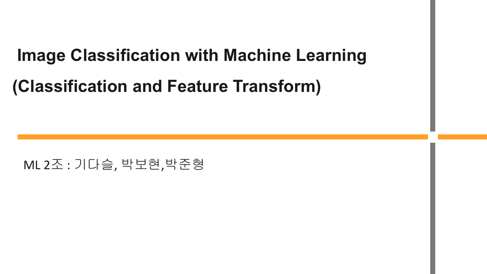
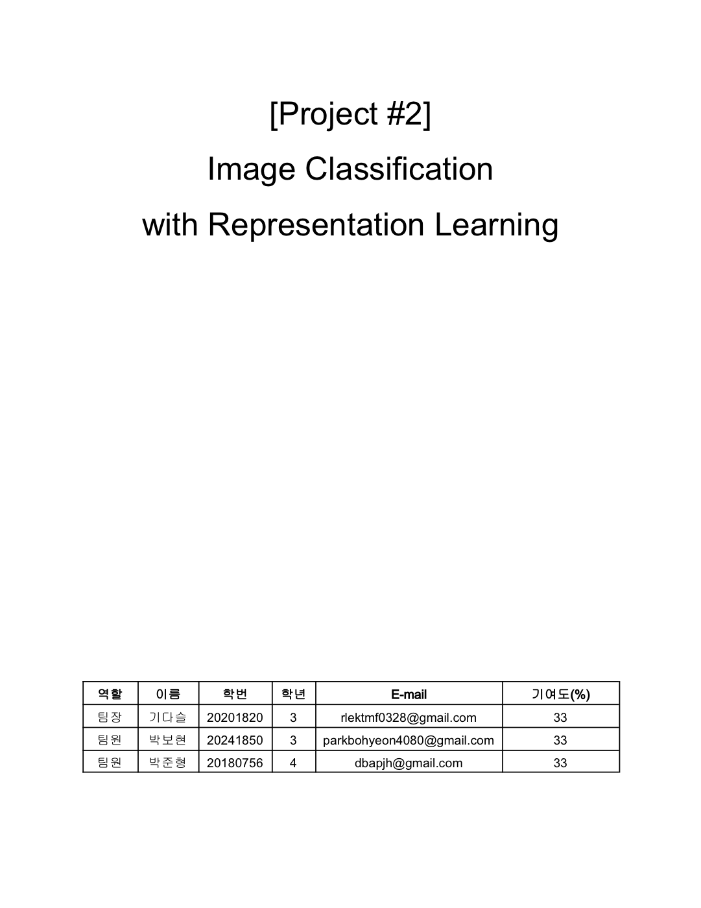
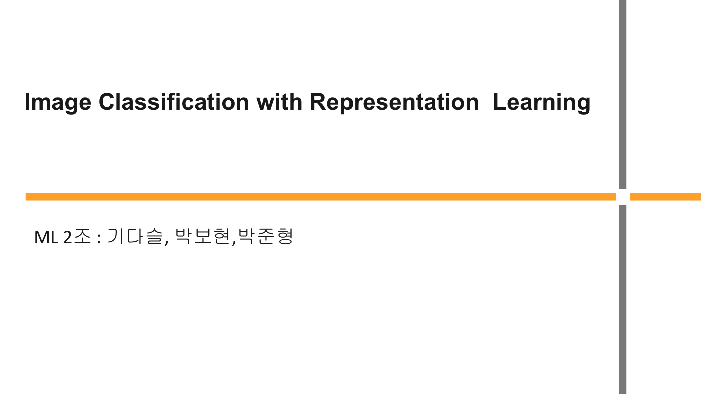
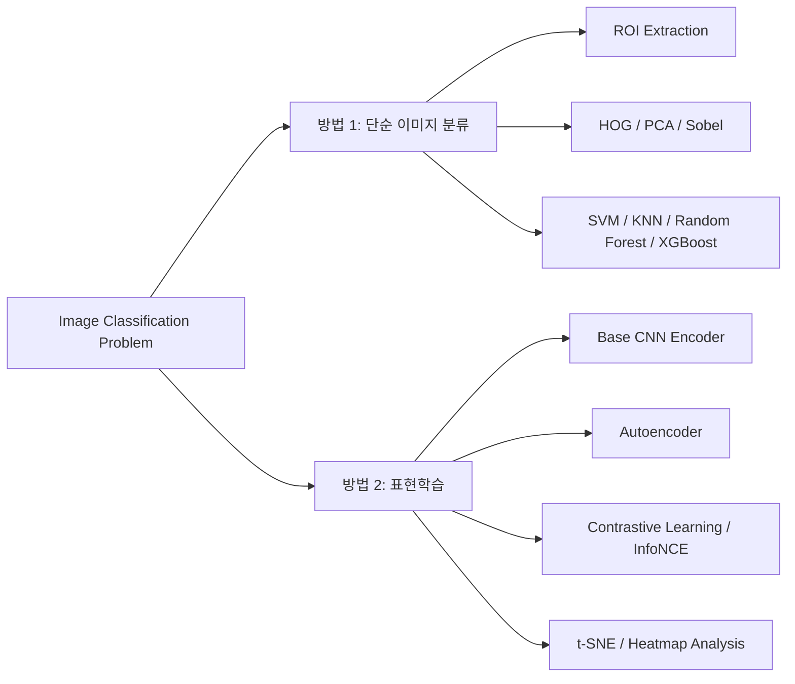
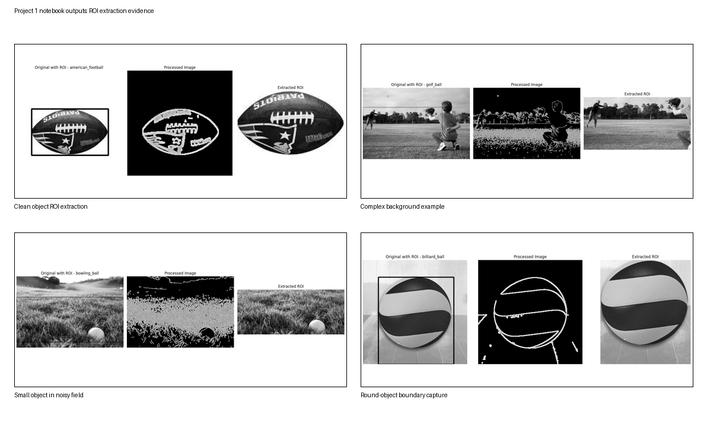

# Machine Learning Project

이 저장소는 MNIST와 SportsBall 데이터를 대상으로 진행한 이미지 분류 프로젝트를 `최종 팀 프로젝트 산출물`, `개인 실험 로그`, `표현학습 확장`으로 다시 정리한 아카이브입니다.  
핵심은 `Project 1 / Project 2`를 단순히 나누는 것이 아니라, `어떤 방식으로 문제를 풀었는가`와 `그 과정에서 어떤 개인 탐구가 있었는가`를 먼저 보이게 하는 것입니다.

- `방법 1. 단순 이미지 분류`
  전처리, ROI, 특징 추출, 분류기 선택을 설계해 정확도를 높이는 접근
- `방법 2. 표현학습`
  latent space와 representation quality를 관찰해 모델의 이해 방식과 실패 원인을 해석하는 접근

## PDF Archive

아래 표지 이미지를 클릭하면 실제 PDF를 바로 열 수 있습니다.

| 구분 | 보고서 PDF | 발표자료 PDF |
| --- | --- | --- |
| 방법 1. 단순 이미지 분류 | .pdf>) | .pdf>) |
| 방법 2. 표현학습 | .pdf>) | .pdf>) |

## 기술 스택

`Python` `NumPy` `OpenCV` `scikit-learn` `XGBoost` `PyTorch` `torchvision` `matplotlib` `Jupyter Notebook`

## 왜 두 방법으로 나눴는가

- `단순 이미지 분류`
  주어진 입력에서 어떤 전처리와 특징 조합이 가장 효율적인지 찾는 것이 중심이었습니다.
- `표현학습`
  입력을 어떻게 잘라낼 것인가를 넘어서, 모델이 feature space를 어떻게 조직하는지 해석하는 것이 중심이었습니다.

즉, 하나는 `정확도 중심`, 다른 하나는 `표현과 해석 중심`의 접근입니다.

## 데이터셋

### MNIST
- 손글씨 숫자 이미지 데이터셋
- 클래스: `0`~`9`
- 구성: Train `450장`, Test `50장`
- 특징: 배경이 단순하고 클래스 구조가 명확함

### SportsBall
- 스포츠 공 이미지 데이터셋
- 클래스: `american_football`, `baseball`, `basketball`, `billiard_ball`, `bowling_ball`, `football`, `golf_ball`, `shuttlecock`, `tennis_ball`, `volleyball`
- 구성: Train `1,000장`, Test `100장`
- 특징: 배경 잡음이 많고 객체 위치와 크기 변화가 큼

MNIST는 특징 비교 실험에 적합했고, SportsBall은 실제 이미지 문제에서 전처리와 표현 방식의 차이가 성능에 어떻게 반영되는지 보여주는 데이터였습니다.

## 보고서 기반 성능 요약

| 방법 | 데이터 | 핵심 성능 | 해석 |
| --- | --- | --- | --- |
| 단순 이미지 분류 | MNIST | `HOG + SVM` 테스트 정확도 `96.0%` | 구조적 특징 기반 접근이 매우 강하게 작동 |
| 단순 이미지 분류 | SportsBall | `XGBoost` 교차검증 정확도 `64.78%` | ROI와 특징 조합이 baseline보다 의미 있게 개선 |
| 단순 이미지 분류 | SportsBall | 최종 테스트 정확도 `37.37%` | 실제 복잡한 이미지에서는 전처리 품질이 성능을 크게 좌우 |
| 표현학습 | MNIST | 테스트 정확도 `98.00%` | latent representation이 비교적 안정적으로 형성 |
| 표현학습 | SportsBall | base model 테스트 정확도 `48.00%` | 표현학습 비교를 위한 기준점 역할 |
| 표현학습 | SportsBall | autoencoder / contrastive 실험에서 `10%`, `9%` 수준 구간 확인 | 성능 향상보다 실패 원인 해석의 의미가 더 큼 |

## 방법 1. 단순 이미지 분류

### 목적
- 이미지를 더 잘 분류하기 위한 `전처리`, `특징 추출`, `분류기 선택`을 찾는 것

### 구현 방식
- 기본 분류기 비교: `Logistic Regression`, `Decision Tree`, `KNN`, `SVM`, `Random Forest`, `XGBoost`
- 특징 추출 비교: `Sobel`, `PCA`, `HOG`
- SportsBall 전용 파이프라인:
  `Contour`, `Bounding Box`, `ROI crop`, `데이터 증강`, `색상 히스토그램`, `k-fold cross validation`

### 개인 탐구 맥락
- SportsBall 전처리 과정의 효율성과 조합은 학교 수업에서 진행한 머신러닝 과목 프로젝트 안에서, 제가 직접 실험하며 축적한 결과입니다.
- `ROI 추출`, `전처리 순서 변경`, `HOG + 색상 히스토그램`, `XGBoost / Random Forest` 비교는 별도 개인 실험 폴더에 누적해 두었고, `ML_1` 보고서는 그 탐구를 정리한 최종 산출물에 가깝습니다.
- 이 방법론의 핵심은 모델 교체 자체보다 `전처리 설계 자체를 연구 대상으로 두고 조합을 탐색했다`는 점입니다.

### 핵심 해석
- MNIST에서는 `HOG + SVM`이 숫자의 구조를 가장 잘 반영했습니다.
- SportsBall에서는 모델보다 먼저 `공이 있는 영역을 얼마나 안정적으로 잘라낼 수 있는가`가 더 중요했습니다.
- 전처리 순서도 성능에 영향을 주었고, `auto_canny -> lighting_correction -> morph_gradient` 순서가 더 좋은 결과를 보였습니다.

### 주요 결과
- MNIST `HOG + SVM` 테스트 정확도: `96.0%`
- SportsBall `XGBoost` 교차검증 정확도: `64.78%`
- SportsBall 최종 테스트 정확도: `37.37%`

### 시각 증거

- 출처: `ML_1/ML_소스코드_02팀.ipynb`
- 구성: `원본 -> 전처리 결과 -> 추출 ROI`
- 의미: SportsBall 분류에서 분류기 이전 단계인 ROI 품질이 얼마나 중요한지 직접 보여 줍니다.

### 관련 문서
- [`ML_1/README.md`](./ML_1/README.md)
- [`ML_1 최종 보고서 PDF`](<./ML_1/ML_1(Image Classification  with Machine Learning).pdf>)
- [`ML_1 발표자료 PDF`](<./ML_1/ML_1(ppt).pdf>)
- [`ML_1 개인 실험 로그 README`](<./ML_1(개인적으로 진행한 실험과정)/README.md>)

## 방법 2. 표현학습

### 목적
- 단순한 분류 결과를 넘어서, 모델이 데이터를 어떤 공간에 어떻게 표현하는지 이해하는 것

### 왜 이 단계로 넘어갔는가
- 전처리와 특징 조합만으로도 일정 수준의 개선은 가능했지만, SportsBall처럼 배경 잡음과 객체 변화가 큰 데이터에서는 한계가 분명했습니다.
- 그래서 다음 단계에서는 `입력을 더 잘 자르는 문제`를 넘어서, `모델 내부의 표현 공간이 어떻게 형성되는가`를 보는 방향으로 확장했습니다.

### 구현 방식
- `Base CNN Encoder` 설계
- `Autoencoder`로 latent representation 학습
- `Projection Head`를 추가해 `Contrastive Learning` 실험
- `InfoNCE` 기반 학습 시도
- `t-SNE` 시각화와 `Heatmap` 분석

### 핵심 해석
- MNIST처럼 구조가 단순한 데이터는 표현학습이 비교적 안정적으로 작동했습니다.
- SportsBall처럼 배경 잡음이 많은 데이터에서는, 표현학습이 항상 성능 향상으로 이어지지 않았습니다.
- 이 방법은 "성공한 결과"보다 "왜 잘 안 되었는지 해석한 과정"에 더 큰 의미가 있었습니다.

### 주요 결과
- MNIST 테스트 정확도: `98.00%`
- SportsBall base model 테스트 정확도: `48.00%`
- autoencoder 기반 실험에서는 테스트 정확도 `10%` 수준 구간 확인
- contrastive learning 실험 결과 `9.00%` 비교 분석

### 시각 증거

- 출처: `[2024-2_ML] Project1 specifications/Project.ipynb`, `mnist/mnist_latent_feature.ipynb`, `sportsball/sportsball_latent_feature.ipynb`
- 구성: K-Means, GMM, t-SNE 기반 feature-space 시각화
- 의미: MNIST와 SportsBall이 latent space에서 얼마나 다르게 분리되는지, 그리고 그 차이가 왜 중요한지 보여 줍니다.

### 관련 문서
- [`ML_2/README.md`](./ML_2/README.md)
- [`ML_2 최종 보고서 PDF`](<./ML_2/ML프로젝트2_02팀/ML_2(Image Classification  with Representation Learning).pdf>)
- [`ML_2 발표자료 PDF`](<./ML_2/ML프로젝트2_02팀/ML_2(ppt).pdf>)

## 구현 과정에서 배운 점

- 좋은 모델은 좋은 입력 데이터에서 시작된다는 점
- 전처리와 특징 추출은 단순한 보조 단계가 아니라 성능 자체를 결정할 수 있다는 점
- 전처리 조합과 순서의 효율성은 직접 실험해서 검증해야 한다는 점
- 표현학습은 언제나 성능 향상으로 이어지지 않으며, 데이터 구조와 학습 목표가 맞아야 한다는 점
- 정확도 숫자만 보는 것보다 `latent space`, `heatmap`, `failure case`까지 함께 봐야 모델을 더 잘 이해할 수 있다는 점

## 저장소 구성

- `ML_1`
  고전적 이미지 분류 팀 프로젝트 최종 보고서, 발표자료, 코드
- `ML_1(개인적으로 진행한 실험과정)`
  수업 프로젝트를 진행하며 직접 확장한 전처리 조합 탐색, ROI 실험, 특징 추출 비교 로그
- `ML_2`
  표현학습 팀 프로젝트 최종 보고서, 발표자료, 코드
- `assets/images`
  보고서, 발표자료, 노트북 출력에서 뽑은 시각 자료
- `[2024-2_ML] Project1 specifications`
  과제 명세와 클러스터링/시각화 노트북
- `datas`, `mnist`, `sportsball`
  실험 데이터와 표현학습 구현 노트북

## 결론

이 저장소는 하나의 이미지 분류 문제를 두고, `전처리와 특징 조합을 직접 탐구한 고전적 분류 접근`과 `latent space를 해석하는 표현학습 접근`을 연결해 정리한 머신러닝 프로젝트 아카이브입니다.
