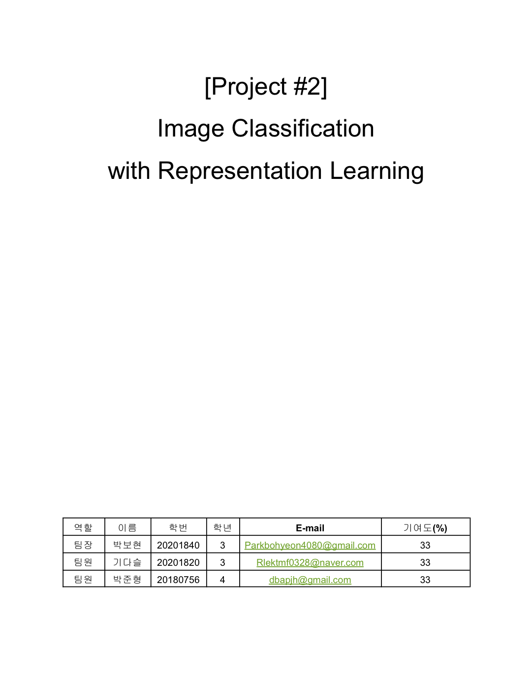
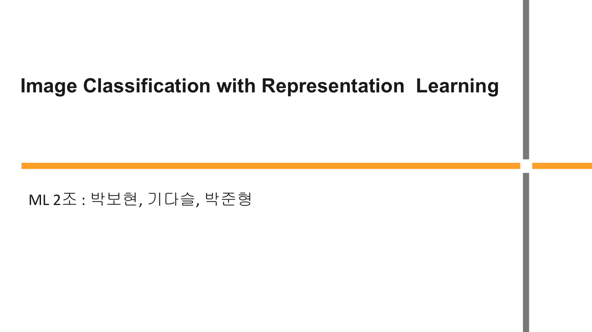
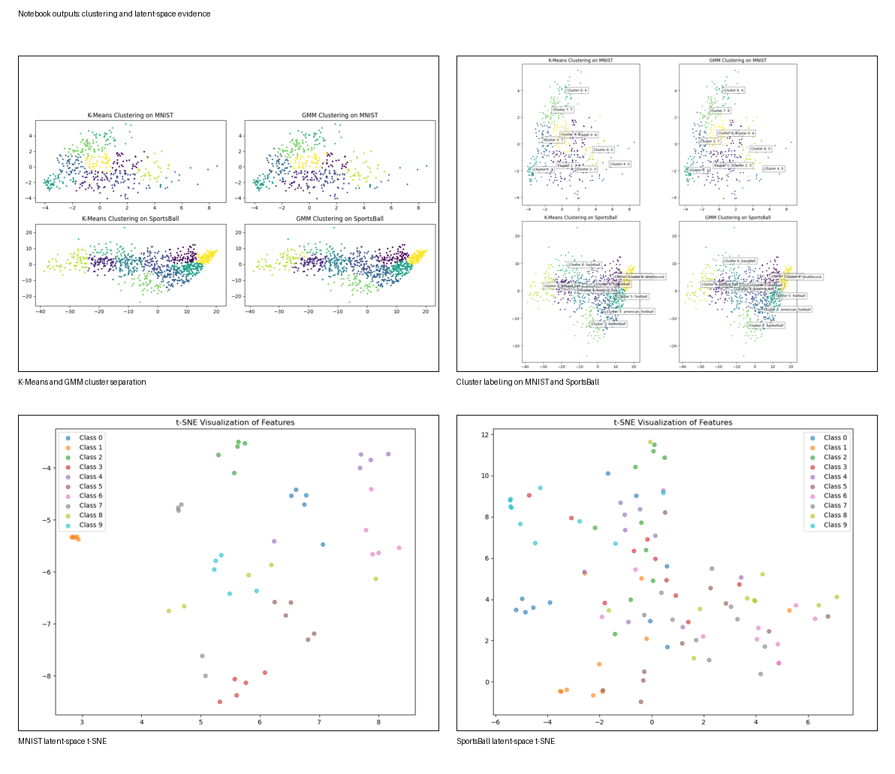

# Representation Learning

루트의 [Image Classification Study README](../README.md) 안에서 `표현학습` 방법에 해당하는 보조 문서입니다.

  
  

## Focus

| 항목 | 내용 |
| --- | --- |
| 목적 | 모델이 데이터를 어떤 공간에 어떻게 표현하는지 이해하는 것 |
| 데이터 | `MNIST`, `SportsBall` |
| 핵심 기법 | `Base CNN Encoder`, `Autoencoder`, `Projection Head`, `Contrastive Learning`, `InfoNCE`, `t-SNE`, `Heatmap` |
| 핵심 포인트 | 성능 향상뿐 아니라 표현 공간이 실제로 어떻게 형성되는지 해석 |

## What Was Implemented

- `Base CNN Encoder`를 설계해 특징 표현 학습
- `Autoencoder`를 적용해 latent representation과 복원 성능 확인
- `Projection Head`를 추가해 contrastive learning 실험
- `InfoNCE` 기반 학습으로 같은 클래스는 가깝게, 다른 클래스는 멀어지게 만드는 구조 시도
- `t-SNE`로 train/test latent space 분포 시각화
- Heatmap으로 모델이 실제로 주목한 영역 해석

## Main Results

| 구분 | 결과 |
| --- | --- |
| MNIST | Train Accuracy `99.56%` |
| MNIST | Test Accuracy `98.00%` |
| SportsBall | Train Accuracy `70.90%` |
| SportsBall | Base model Test Accuracy `48.00%` |
| SportsBall | Autoencoder 기반 표현학습 실험에서는 테스트 정확도 `10%` 수준 구간 확인 |
| SportsBall | 최종 분석에서 성능이 좋지 않았던 contrastive learning 실험 결과 `9.00%` 비교 |

## Evidence

- 출처: `[2024-2_ML] Project1 specifications/Project.ipynb`, `../mnist/mnist_latent_feature.ipynb`, `../sportsball/sportsball_latent_feature.ipynb`
- 구성: K-Means, GMM, 그리고 t-SNE 기반 feature-space 시각화
- 의미: MNIST는 클래스 간 분리가 비교적 선명하고, SportsBall은 배경과 객체 변화 때문에 latent space가 더 넓고 복잡하게 퍼지는 경향을 보여 줍니다.

## Why This Method Matters

- MNIST처럼 구조가 단순한 데이터는 표현학습이 안정적으로 작동했습니다.
- SportsBall처럼 배경 잡음이 많고 객체가 복잡한 데이터는, 표현학습만으로 바로 성능이 좋아지지 않았습니다.
- 이 단계의 가장 큰 의미는 "왜 성능이 낮았는가"를 latent space와 heatmap으로 설명한 점입니다.
- 결과적으로 표현학습은 항상 성능 향상으로 이어지는 것이 아니라, 데이터 구조와 학습 목표가 잘 맞아야 한다는 점을 확인했습니다.

## Notes Before Reproducing

- 노트북 내부 경로가 과거 로컬 환경인 `/home/gidaseul/Documents/GitHub/ML_2/...` 로 남아 있어 현재 폴더 구조에 맞는 수정이 필요합니다.
- `contrastive_t_sne(test).ipynb`는 `contrastive_weights3.pth`를 불러오도록 되어 있지만, 현재 폴더에는 `contrastive_weights.pth`가 있어 파일명 또는 경로를 맞춰야 합니다.

## Summary

표현학습 방법은 단순히 정확도를 높이기 위한 실험이 아니라,  
`latent space가 어떻게 형성되는지`, `왜 어떤 경우에는 잘 작동하지 않는지`를 해석하기 위한 접근이었습니다.
